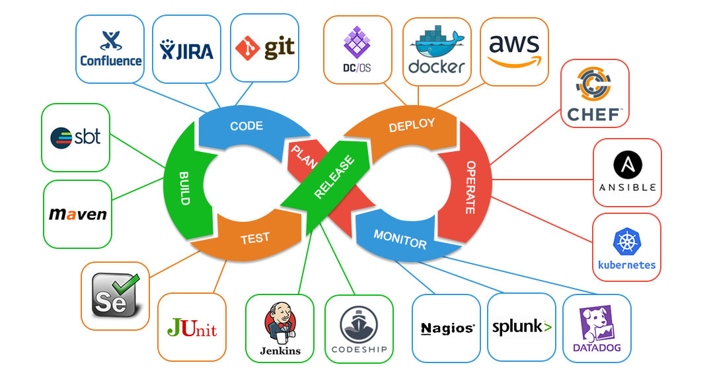

# Photoquest Pipeline Examples

This is an example of how a CI/CD pipeline can be set up for a project. The goal here is to run a build of the Photoquest project, build the application, and then run tests on the build.

## Coding as a team

1. Good Comments
2. Follow deployment patterns - [Gitflow](https://www.atlassian.com/git/tutorials/comparing-workflows/gitflow-workflow#:~:text=Gitflow%20is%20a%20legacy%20Git,software%20development%20and%20DevOps%20practices.)
    - Create a feature branch
    - Commit changes
    - Test
    - Make a PR to merge in to Dev
    - Test on Dev
    - Approve PR
    - Merge in to Development
    - PR Dev into main
    - Test on main
    - Merge in to main
3. Linting your code - Make sure your code follows a defined style your teammates decide on
4. Keep changes small - Some places have soft limits on how many lines can be affected in a PR.
5. Be careful of dependencies - Some are easy to justify, like the net/http package in Go. However, it is becoming more and more difficult to track all modules that your application depends on. Especially in the Node.js world, there have been [attacks on some of the most popular packages](https://arstechnica.com/information-technology/2021/09/npm-package-with-3-million-weekly-downloads-had-a-severe-vulnerability/).
6. Application teams are really starting to focus on pulling in team members from all different backgrounds. Front-End, Back-End, DevOps, Cloud Infrastructure, QA, Database.

## Pipeline Example

If you look on the actions tab in this project, there is an example of a CI/CD pipeline. This pipeline starts when ever a push is made to the repo and has the following steps

1. It checks out the code pushed up
2. It runs a build of that code
3. It runs a series of tests on that code

There is a second pipeline that only ever acts when a PR is made. Currently, it attempts (and fails) to run a linting and will fail if the test doesn't pass.

## DevOps

DevOps is a methodology that refers to the process of automating the deployment, testing, and release of software. It's only been around for 10 to 12 years, but it has allowed teams to build and deploy software faster and more reliably. Testing is built in to the release process so developers can run a `git push` and the code will get reviewed and eventually deployed.

Being familiar with the DevOps cycle below can help you stand out during the interview process.

### DevOps references

[The Phoenix Project](https://www.amazon.com/The-Phoenix-Project-audiobook/dp/B00VATFAMI/ref=sr_1_1?keywords=the+phoenix+project&qid=1651178674&sprefix=the+phoenix+%2Caps%2C99&sr=8-1)  - A work of fiction that is about why companies should adopt DevOps. If you have worked a help desk, this one will hit a bit close to home. Get it in Audiobook form.  
[The Unicorn Project](https://www.amazon.com/The-Unicorn-Project-Gene-Kim-audiobook/dp/B0812C82T9/ref=sr_1_1?crid=13K0OR6IRFCWL&keywords=the+Unicorn+project&qid=1651178712&s=audible&sprefix=the+unicorn+project%2Caudible%2C74&sr=1-1)  - The fictional reverse of the Phoenix Project as told from the software developer point of view. Goes in to Microservices, proper ways to test code, API's, and creating code that can be consumable by other devs.  
[The DevOps Handbook](https://www.amazon.com/DevOps-Handbook-Second-World-Class-Organizations/dp/B09L56CT6N/ref=sr_1_9?crid=2SO6B9ER705CB&keywords=devops+handbook&qid=1651179001&s=audible&sprefix=devops+handbook%2Caudible%2C76&sr=1-9)  
[Accelerate](https://www.amazon.com/Accelerate-Building-Performing-Technology-Organizations/dp/B07BMBYHXL/ref=sr_1_1?crid=16W84B4OVH0N0&keywords=accelerate&qid=1651179020&s=audible&sprefix=accelerate%2Caudible%2C74&sr=1-1)

## Technical Interviews

First things first, some companies have a habit of making technical exams that are longer than a 8 hours. If it is this amount of work, ask yourself if you want do want this position. Usually if they are unreasonable here, they will be unreasonable later on. Also, since you are trying for your first developer position, it might be worth it just so you get your start in software development.

Technical interviews will typically ask you to solve a problem or create a new feature in an application. You may get additional requests like creating a unit test or package an application in a Docker container.

## Interview Questions you should prep for

- Be prepared to show and example in your past experience where you were incorrect about something, dealt with a difficult bug/issue, or had a different approach to solving a problem.
- Be prepared to have questions that you aren't quite sure of the answer to. Admit that you don't know the answer but explain how you would go about getting that answer. These are honesty checks and it isn't a bad thing to not know. Personally, I have turned down interviewees that double down on a wrong answer.

## Interview Questions you should ask

1. What does success in this position look like? After six months? After a year?

## Interview Don'ts

Salary should be discussed as early as possible with the HR department, not in the Engineering interview. First one to give a number loses.

## Job searching

Check our local big companies in SE michigan for an entry level software engineer.

You might have good luck at smaller companies as well. Atomic Object is a good example in Ann Arbor as well as the job boards for Ann Arbor Spark.

Contract houses might be an option as well. TekSystems is one of SE Michigan's largest.
